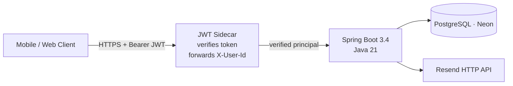
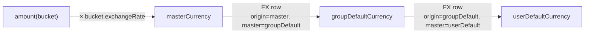
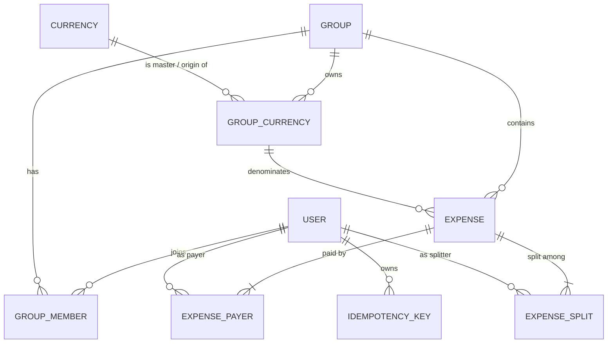

# ChipIn — Technical Project Overview

> A Splitwise-style expense-sharing backend, designed end-to-end as a single-author Spring Boot service. Focused on the parts that are usually hand-waved in this category: **multi-currency math**, **safe money transactions**, and **defensible authorization**.

This document is a guided tour for someone evaluating the project — recruiter, hiring manager, or future collaborator. It walks through the problem, the design choices, the parts I'm proud of, and the trade-offs I'm aware of.

---

## 1. The problem

A group of friends spends money in many places, in many currencies, on each other's behalf. The product needs to answer two deceptively hard questions any time anything changes:

1. **"How much do *I* owe *you*?"** — pairwise, in the currency that makes sense to whoever's asking.
2. **"What's the cheapest set of payments that settles everyone?"** — the classic minimum-cash-flow problem, but with the twist that the currency a debt was *incurred* in might not be the one anyone wants to *settle* in.

ChipIn implements both, plus the long tail (custom currencies for trips like `YEN-Day1`, idempotent settle-up, custom split modes, invitation flow).

---

## 2. Architecture at a glance



Inside the service the layering is conservative on purpose — predictable beats clever for money.

```mermaid
flowchart TB
    subgraph "Web layer"
        C[Controllers<br/>@RestController]
        GEH[GlobalExceptionHandler]
        Sec[SecurityConfig + JwtAuthenticationFilter]
    end

    subgraph "Domain services"
        AG[AccessGuard]
        IS[IdempotencyService]
        ES[ExpenseService]
        SS[SettlementService]
        GS[GroupService]
        HS[HomeService]
        CR[CurrencyResolutionService]
        US[UserService / AuthService]
        Inv[InvitationService]
    end

    subgraph "Persistence"
        R[Spring Data JPA Repositories]
        H[(Hibernate)]
    end

    C --> AG
    C --> IS
    C --> ES & SS & GS & HS & US & Inv
    ES --> CR
    SS --> CR
    GS --> CR
    HS --> CR
    ES --> AG
    SS --> AG
    GS --> AG
    Inv --> AG
    AG --> R
    IS --> R
    ES & SS & GS & HS & US & CR & Inv --> R
    R --> H
    H -->|JDBC| DB[(Postgres)]
```

The service surface intentionally has very few "controllers calling other controllers" or "services calling controllers" patterns. Every state change goes through a service; every authorization check goes through `AccessGuard`; every money-moving POST goes through `IdempotencyService`.

---

## 3. The two systems worth talking about

Two subsystems carry most of the design work. Both are documented here in enough detail that you could re-implement them from scratch.

### 3.1 Currency Resolution Chain

Every expense is recorded in a **bucket** — a `GroupCurrency` row. A bucket has three currency references:

| Field | Meaning | Example |
|-------|---------|---------|
| `originCurrency` | What the bucket is *denominated* in | `JPY` for a `YEN-Day1` bucket |
| `masterCurrency` | The true ISO currency the bucket converts to | `JPY` |
| `exchangeRate` | `1 unit of bucket = exchangeRate units of masterCurrency` | `1.0` |

To take a bucket amount and project it into the **group's default currency** and the **viewer's default currency**, the resolver walks a three-hop chain:



Two things make this interesting:

- **FX rows live in the same table as buckets.** A `GroupCurrency` with `originCurrency ≠ masterCurrency` *is* an FX rate. Same upsert endpoint (`PUT /api/groups/{id}/fx-rates`), one storage primitive, no shadow table.
- **Failure is data, not an exception.** If any hop is missing — say no `JPY → INR` rate exists yet — the resolver records the pair (`"JPY->INR"`) in a `missingRates` set and returns `null` for that view. The endpoint still answers; the UI gets to render *partial* data plus a structured "what's missing" list.

Every aggregate response (dashboard, balances, home views) exposes three views in parallel:

```json
{
  "rawByCurrency":          { "JPY": "12500.00", "INR": "4000.00" },
  "totalInGroupDefault":    "10000.00",
  "totalInUserDefault":     "120.00",
  "userDefaultCurrencyCode": "USD",
  "missingRates":           []
}
```

Internal math runs at scale 8 with `RoundingMode.HALF_EVEN` (banker's rounding); rounding to 2 dp happens only at the DTO boundary so we don't accumulate drift across many small expenses.

Implementation: `services/CurrencyResolutionService.java`. Test fixtures: `CurrencyResolutionServiceTest` (covers happy path, missing rate, multi-hop, custom bucket on top of FX).

### 3.2 Idempotent money endpoints

Network blips and double-taps are not optional in a mobile app. The two real money-moving POSTs — `POST /api/settlements` and `POST /api/groups/{groupId}/expenses` — require an `Idempotency-Key` header (Stripe-style):

```mermaid
sequenceDiagram
    autonumber
    participant Client
    participant API as Spring
    participant DB as Postgres

    Client->>API: POST /api/settlements<br/>Idempotency-Key: 0c3b…
    API->>DB: SELECT FROM idempotency_keys<br/>WHERE (user_id, key)
    DB-->>API: not found
    API->>DB: INSERT settlement + idempotency row<br/>(same transaction)
    DB-->>API: committed
    API-->>Client: 200 OK { settlementId, status: SUCCESS }

    Note over Client,API: network glitch — client retries
    Client->>API: POST /api/settlements (same body + key)
    API->>DB: SELECT FROM idempotency_keys
    DB-->>API: row found, hash matches
    API-->>Client: 200 OK (replayed; no new ledger entry)
```

The implementation is small but covers the edges that usually go wrong:

| Scenario | Behaviour |
|---|---|
| First call | Action runs, response cached, returned. |
| Retry, same body | Cached response returned. Action **not** re-executed. |
| Retry, different body | `422 Idempotency-Key reused with a different request payload` |
| Two concurrent retries | One wins the unique `(user_id, key)` constraint; the loser's whole transaction (action included) is rolled back, returns `409` so the next retry hits the cache. **No duplicate ledger entry is ever written.** |
| Wrapped action throws | Nothing cached; client may safely retry the same key. |
| Expired row (TTL = 24 h) | Lazily deleted on next reuse, then the action runs fresh. |

Implementation: `services/IdempotencyService.java`. The wrapped action runs inside the same `@Transactional` scope as the idempotency-row save, so either *both* commit or *neither* does. Seven unit tests cover the table above (`IdempotencyServiceTest`).

---

## 4. Authorization model

Authorization is centralized in `services/AccessGuard.java`. Every controller call that takes a `groupId` either explicitly calls `AccessGuard.requireGroupMember(groupId, user)` or `AccessGuard.requireGroupAdmin(...)`. The guard:

- Loads the group (404 if missing).
- Loads the membership for the principal (404 — *not 403*, to avoid leaking existence).
- Optionally checks the admin flag.

This single shape eliminated a half-dozen pre-existing IDOR bugs found in code review (see `CODE_REVIEW.md` §P1.1). It also enabled a clean "authorize on entry, not on data load" pattern that the rest of the service can rely on.

A separate but related fix: settlement creation now refuses to record a payment on someone else's behalf unless the actor is a group admin (`SettlementService.createSettlement`).

---

## 5. Data model highlights



A few choices worth noting:

- **Settlements are expenses.** A `Settlement` is an `Expense` with `type = SETTLEMENT` and a single payer/single splitter. This avoided a separate ledger table and let every aggregate query stay uniform (`SELECT FROM expenses WHERE …` is enough). Cost: every read path has to filter on `type` when it wants only "real" expenses.
- **Custom currencies sit in `group_currencies`.** Same table holds: (a) the group's allowed-currency list, (b) custom buckets like `YEN-Day1`, and (c) FX rate rows. Different roles distinguished by `originCurrency` vs `masterCurrency` semantics, not separate tables. Trade-off: queries against the table are a bit harder to read; payoff: one CRUD surface and one consistency invariant.
- **`idempotency_keys (user_id, idempotency_key)` is uniquely indexed** — that single constraint is what makes the concurrent-retry path correct.
- **Optimistic locking** via `@Version` on `User`, `Expense`, `Group`, `Currency`. Conflicts surface as `OptimisticLockException` and bubble up to the `409` mapping in the global handler.

Schema is currently a single `chip_in_core` schema in PostgreSQL. Two scripted migrations exist (origin/active columns on `group_currencies`; new `idempotency_keys` table); both documented in `API_CONTRACT.md` §12 and `CODE_REVIEW.md` §Schema migration.

---

## 6. Split-math correctness

Pre-refactor the service trusted the client's split breakdown. That's an attack vector. The current `ExpenseService.createExpense`:

1. Loads every payer + splitter and verifies group membership.
2. Asserts `sum(payers.paidAmount) == expense.amount` (±0.01 tolerance).
3. **Recomputes** the splits server-side from the raw inputs, regardless of what the client sent:
   - `EQUAL`: even share, last member absorbs the rounding remainder.
   - `EXACT`: caller's `amountOwed` preserved; `sum(splits) == amount` required.
   - `PERCENTAGE`: `sum(rawValue) == 100`; amounts derived from percentages.
   - `SHARES`: pro-rata from positive raw shares.

The client cannot persuade the server that `Alice owes ₹0.01` when she owes `₹100`.

`SplitType` is a true enum on the entity now (was a free-form string), so misspellings die at deserialization.

---

## 7. Tech stack

| Layer | Choice | Why |
|------|--------|----|
| Language | Java 21 | Pattern matching, records, virtual threads if needed later |
| Framework | Spring Boot 3.4 | Mature, predictable, good observability ecosystem |
| Build | Maven + Spring Boot plugin | Single-author project; Gradle didn't pay for itself |
| Persistence | Spring Data JPA + Hibernate 6 | CRUD-heavy domain; JPQL is fine for the aggregates here |
| DB | PostgreSQL (Neon) | Money + multi-currency + uniqueness constraints — Postgres for boring reliable wins |
| Validation | Jakarta Bean Validation 3.0 via `spring-boot-starter-validation` | Annotation-driven validation on every DTO |
| Security | Spring Security 6 + JJWT 0.12 | JWT today; sidecar tomorrow |
| Docs | springdoc-openapi-ui (Swagger) | `API_CONTRACT.md` is the source of truth; Swagger is generated |
| Tests | JUnit 5 + Mockito | Pure unit tests for services; integration tests planned |
| Container | Multi-stage `Dockerfile` (Temurin 21 JRE) | Reproducible builds; cache friendly |

---

## 8. Test coverage today

```
CurrencyResolutionServiceTest   4 tests   single-hop, multi-hop, missing rate, raw aggregation
GroupServiceTest                6 tests   greedy minimum-cash-flow correctness
IdempotencyServiceTest          7 tests   first call, replay, body mismatch, endpoint mismatch,
                                          malformed key, concurrent race, expired row
─────────────────────────────────────────────
Total                          17 tests   all green on `mvn clean test`
```

Pure unit tests, no Spring context, no DB — they run in ~2 s. Integration / MockMvc / WebMvcTest coverage is in the production-readiness backlog.

---

## 9. Code-quality bar I held myself to

- **No money in `double`.** Every monetary field is `BigDecimal`. The one DTO that still used `Double` was rewritten in this iteration.
- **No magic strings for enums.** `SplitType`, `ExpenseType`, `AuthProvider`, `UserStatus` all live in `entities/enums/`.
- **No reading the principal from session.** Every controller pulls the authenticated user from `SecurityContextHolder` once and passes it down.
- **No catching `Exception`.** Specific `ResponseStatusException` with proper HTTP statuses (`400/401/403/404/409/422`). The global handler is the only generic-catch site.
- **No leaking the `User` entity outbound** through public APIs. Responses use DTOs (`FriendResponse`, `UserResponse`, etc.). The password hash never appears in JSON.
- **Logging never includes** passwords, JWTs, invitation tokens, or raw idempotency keys.

The full code-review trail is preserved in `CODE_REVIEW.md`, including the items deliberately deferred to a sidecar / infra layer.

---

## 10. What I'd do differently

A short list of honest "next iteration" notes — these are not blockers but they're the things I'd push for in a real team.

- **Settlements should track the FX context they happened in.** Today a settlement is one currency, period. When the underlying debt spans multiple master currencies, the UI has to do gymnastics. A real solution stores a `settlement_legs` table with one row per master currency cleared.
- **CQRS for read paths.** The dashboard aggregates are computed every time. A `group_balance_summary` materialized view (refreshed on expense / settlement insert) would cut latency a lot.
- **Outbox for FX upserts.** Today the FX upsert is a single API write. In a multi-instance deploy this should publish a `fx_rate_changed` event so caches and downstream consumers can react.
- **Flyway from day one.** I went with Hibernate `ddl-auto` to move fast; the migration to versioned SQL is now its own task. Won't repeat that mistake.
- **OpenTelemetry from day one.** Logs alone don't tell you why a request was slow.

---

## 11. Where to look in the code

| You want to see… | Go to |
|---|---|
| The three-view currency aggregation | `services/CurrencyResolutionService.java` |
| Idempotency mechanics | `services/IdempotencyService.java` + `IdempotencyServiceTest` |
| Centralized authorization | `services/AccessGuard.java` |
| Server-side split math validation | `services/ExpenseService.java` (`createExpense`) |
| Minimum cash flow algorithm | `services/GroupService.calculateSettlements` |
| Custom currency / FX CRUD | `controller/GroupController` `*currencies*` + `*fx-rates*` endpoints |
| The auth flow as it stands today | `services/AuthService.java`, `config/JwtAuthenticationFilter.java`, `services/JwtService.java` |
| The full API surface | `API_CONTRACT.md` (handwritten, kept in sync with controllers) + Swagger UI at runtime |
| What's left before launch | `PRODUCTION_READINESS.md` |
| Original review trail | `CODE_REVIEW.md` |

---

_ChipIn is a personal project. It's deliberately one service — multi-currency, multi-tenant, idempotent — written end to end so I can talk through every decision rather than every framework option._
