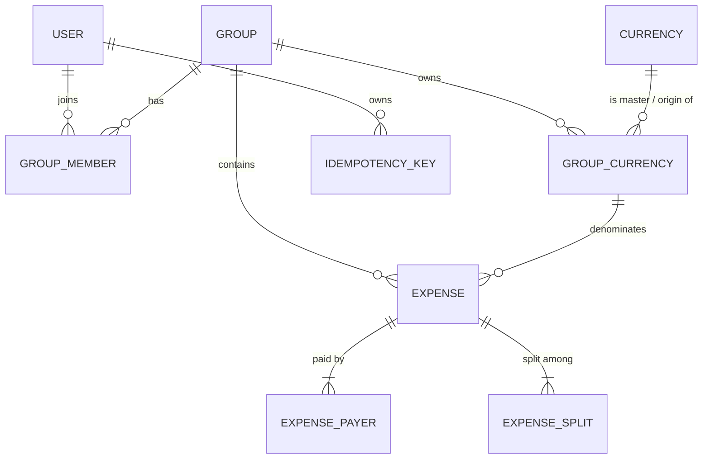

# ChipIn — Private README (read this first when you come back)

This is the personal-repo README. If you're reading it months later, it should give you everything to get the service running, remember why it's built the way it is, and pick up the next task without re-discovering the codebase. Public-facing showcase is in `PROJECT_OVERVIEW.md`.

> **Heads up:** there are still committed secrets in `application.properties` (Neon DB password, JWT HMAC key). Don't push this repo public until you've done §1 of `PRODUCTION_READINESS.md`. The Neon DB and signing key in git history must be rotated first.

---

## TL;DR — five-minute resume

```bash
# 1. Java 21 + Maven on PATH
java --version    # 21.x
mvn --version

# 2. Run unit tests (no DB needed)
mvn -DskipITs -Dtest='!ChipInApplicationTests' clean test

# 3. Local Postgres (run once)
docker run -d --name chipin-pg -p 5432:5432 \
  -e POSTGRES_PASSWORD=postgres \
  -e POSTGRES_DB=chipin \
  postgres:16
psql -h localhost -U postgres -d chipin -c "CREATE SCHEMA chip_in_core;"
# then run the SQL blocks in API_CONTRACT.md §12 and CODE_REVIEW.md §Schema migration

# 4. Edit application-local.properties (NOT application.properties) with local creds, then:
SPRING_PROFILES_ACTIVE=local mvn spring-boot:run

# 5. Hit it
open http://localhost:8080/swagger-ui/index.html
```

---

## What ChipIn is (one paragraph)

Splitwise-style expense sharing with **first-class multi-currency support** (custom per-group buckets like `YEN-Day1`, FX rates as rows in the same table, three-view aggregation across viewer/group/raw currencies) and **idempotent money endpoints** so client retries can't double-write settlements or expenses. Centralized authorization through `AccessGuard`. PostgreSQL + Spring Boot 3.4 + Java 21.

---

## Repository map

```
src/main/java/com/chipIn/ChipIn/
├── ChipInApplication.java          # entrypoint
├── config/
│   ├── ApplicationConfig.java      # PasswordEncoder, AuthenticationManager, OpenAPI bean
│   ├── SecurityConfig.java         # Spring Security filter chain (JWT-only today)
│   ├── JwtAuthenticationFilter.java
│   ├── GlobalExceptionHandler.java # ⚠ needs hardening — see PRODUCTION_READINESS.md §1.4
│   └── SwaggerConfig.java
├── controller/                     # @RestController per resource
├── dto/                            # request + response DTOs (all @Valid-annotated)
├── entities/                       # JPA entities
│   ├── enums/                      # SplitType, ExpenseType, AuthProvider, UserStatus
│   └── IdempotencyKey.java         # the idempotency cache
├── repository/                     # Spring Data JPA repos
├── services/
│   ├── AccessGuard.java            # centralized authz (member / admin)
│   ├── CurrencyResolutionService.java  # 3-hop currency math
│   ├── IdempotencyService.java     # Stripe-style idempotency
│   ├── ExpenseService.java         # server-side split validation
│   ├── SettlementService.java
│   ├── GroupService.java           # incl. minimum-cash-flow algorithm
│   ├── HomeService.java            # dashboard aggregations
│   ├── AuthService.java / UserService.java / JwtService.java
│   ├── InvitationService.java
│   └── impl/
│       └── ResendEmailServiceImpl.java   # ⚠ currently a mock — see PRODUCTION_READINESS.md §1.8
└── util/                           # CORS config, response wrappers, ErrorResponse

src/test/java/com/chipIn/ChipIn/services/
├── CurrencyResolutionServiceTest.java
├── GroupServiceTest.java
└── IdempotencyServiceTest.java

API_CONTRACT.md         # canonical API surface (read this before changing endpoints)
CODE_REVIEW.md          # review trail and rationale for every refactor done so far
PROJECT_OVERVIEW.md     # public/portfolio-facing technical writeup
PRODUCTION_READINESS.md # full list of what's left to do
```

---

## Running locally

### Prereqs

- Java 21 (Temurin or any JDK 21).
- Maven 3.9+ (or use `./mvnw`).
- Docker, if you don't have a local Postgres.

### Database setup

1. Start Postgres (any version 14+ works; we run 16):
   ```bash
   docker run -d --name chipin-pg -p 5432:5432 \
     -e POSTGRES_PASSWORD=postgres \
     -e POSTGRES_DB=chipin \
     postgres:16
   ```
2. Create the schema (we keep everything in `chip_in_core`):
   ```sql
   CREATE SCHEMA chip_in_core;
   ```
3. Apply the SQL blocks in **`API_CONTRACT.md` §12** (idempotency table + `group_currencies.origin_currency_id` + `is_active`) and any pending statements in `CODE_REVIEW.md §Schema migration`.
4. Eventually replace this manual step with Flyway — tracked in `PRODUCTION_READINESS.md` §1.7.

### Profiles

There is one profile today: `local`. Configuration is in `src/main/resources/application.properties`.

Until Flyway lands and we split profiles properly, the recommended workflow is:

1. Copy `application.properties` to `application-local.properties` (gitignored).
2. Override DB + JWT secret there.
3. Run with `SPRING_PROFILES_ACTIVE=local`.

### Environment variables (target state)

We will move to env-only config. The variables expected:

| Variable | What | Example |
|---|---|---|
| `SPRING_DATASOURCE_URL` | JDBC URL | `jdbc:postgresql://localhost:5432/chipin?currentSchema=chip_in_core` |
| `SPRING_DATASOURCE_USERNAME` | DB user | `chipin_app` |
| `SPRING_DATASOURCE_PASSWORD` | DB password | (from secret manager) |
| `JWT_SECRET` | Base64 HMAC-SHA256 key, ≥256 bits | `openssl rand -base64 64` |
| `JWT_EXPIRATION_MS` | Access-token lifetime | `900000` (15 min) once refresh tokens land |
| `CHIPIN_CORS_ALLOWED_ORIGINS` | CSV of origins | `https://app.chipin.example` |
| `RESEND_API_KEY` | Resend email API key | `re_…` |
| `CHIPIN_FRONTEND_URL` | Used to build invitation URLs | `https://app.chipin.example` |

### Running the service

```bash
# Tests only (no DB)
mvn -DskipITs -Dtest='!ChipInApplicationTests' clean test

# Boot the app
mvn spring-boot:run

# OR build a jar and run it
mvn clean package -DskipTests
java -jar target/ChipIn-0.0.1-SNAPSHOT.jar

# OR Docker
docker build -t chipin-service:dev .
docker run --rm -p 8080:8080 \
  -e SPRING_DATASOURCE_URL=... \
  -e SPRING_DATASOURCE_USERNAME=... \
  -e SPRING_DATASOURCE_PASSWORD=... \
  -e JWT_SECRET=... \
  chipin-service:dev
```

`ChipInApplicationTests.contextLoads` is the one test that boots a full Spring context. It depends on a reachable Postgres with the right credentials — fine to skip in unit-test runs (`-Dtest='!ChipInApplicationTests'`).

### Test users

The pytests in `pytests/` log in with hardcoded test accounts (`hendricksgeek@gmail.com` etc., password `"password"`). These exist in the dev Neon DB only. Replace with fixtures driven by env vars before any new environment goes live.

---

## Architecture cheat sheet

If you only remember three things, remember these:

1. **Every state-changing request runs through `AccessGuard`**. Controllers call `accessGuard.requireGroupMember(...)` or `requireGroupAdmin(...)` first. Skipping it is the most common way to reintroduce IDOR bugs.
2. **Every money-moving POST runs through `IdempotencyService`.** The header `Idempotency-Key` is mandatory on `POST /api/settlements` and `POST /api/groups/{groupId}/expenses`. The wrapped action runs inside the same `@Transactional`, so the cache row and the side-effects commit together. Detail in `API_CONTRACT.md` §1.1.
3. **Every monetary aggregate returns three views**: `rawByCurrency`, `totalInGroupDefault`, `totalInUserDefault`, plus a `missingRates` list. The math lives in `CurrencyResolutionService`. See `PROJECT_OVERVIEW.md` §3.1 for the chain.

Other invariants worth knowing:

- A `Settlement` is an `Expense` with `type = SETTLEMENT`. Every aggregate query filters by `type` when it needs "real" expenses only.
- `GroupCurrency` rows wear three hats — group's allowed currency, custom bucket (`YEN-Day1`), and FX rate row. Disambiguated by `originCurrency` vs `masterCurrency`.
- Split math is recomputed server-side regardless of what the client sends. Client-supplied splits are inputs to the formula, not the source of truth.

---

## API contract

`API_CONTRACT.md` is the source of truth. Swagger UI is generated from controllers at `http://localhost:8080/swagger-ui/index.html`. If the two disagree, fix Swagger to match `API_CONTRACT.md` and add a unit test, not the other way around.

Quick map:

| Resource | Verb + path | Notes |
|---|---|---|
| Auth | `POST /auth/signup`, `POST /auth/login`, `POST /auth/logout` | logout rotates `tokenVersion` of the principal |
| Users | `GET / PUT /api/users/me`, `GET /api/users/friends`, `GET /api/users/search` | search returns `FriendResponse`, never `User` |
| Groups | `POST/GET/PUT/DELETE /api/groups/...` | admin-checked via `AccessGuard` |
| Group currencies | `POST/GET/PUT/DELETE /api/groups/{id}/currencies` | custom buckets |
| FX | `PUT /api/groups/{id}/fx-rates` | upsert an `originISO → masterISO` row |
| Expenses | `POST /api/groups/{id}/expenses` (needs `Idempotency-Key`), `GET /api/groups/{id}/expenses/{eid}` | server validates split math |
| Settlements | `POST /api/settlements` (needs `Idempotency-Key`) | actor must be payer or admin |
| Home | `GET /api/home/groups`, `GET /api/home/friends` | three-view aggregation |
| Invitations | `POST /api/invitations/invite`, `POST /api/invitations/register` | admin check on invite if `groupId` supplied |

---

## Where the state lives



- All tables live in `chip_in_core`.
- Optimistic locking via `@Version` on `User`, `Group`, `Expense`, `Currency`.
- Unique indexes worth remembering:
  - `idempotency_keys (user_id, idempotency_key)` — required for the concurrent-retry guarantee.
  - `group_currencies (groupid, origin_currency_id, master_currency_id) WHERE origin_currency_id IS NOT NULL AND is_active` — one FX row per origin/master per group.

---

## Common dev tasks

| Task | How |
|---|---|
| Add a new endpoint | (1) extend `API_CONTRACT.md`, (2) DTOs with `@Valid`, (3) controller with `AccessGuard`, (4) service, (5) unit test. |
| Add a new state-changing endpoint that handles money | Wrap the service call in `idempotencyService.executeIdempotent(...)`. Require `Idempotency-Key` header. Add a row to the table in `API_CONTRACT.md` §1.1. |
| Add a column | Until Flyway lands: write the SQL in `CODE_REVIEW.md §Schema migration` so future-you finds it, then update the entity. After Flyway lands: create a `V{n}__….sql` file. |
| Add a new currency | Insert into `currencies` (global) — `code` (ISO-4217), `name`, `symbol`. Then per group either add a `GroupCurrency` bucket or an FX row via `PUT /api/groups/{id}/fx-rates`. |
| Change a split rule | `services/ExpenseService.createExpense` is the source of truth. Update there + add a unit test in `ExpenseServiceTest` (doesn't exist yet — add it). |
| Run a specific test class | `mvn -Dtest=IdempotencyServiceTest test` |
| Regenerate Swagger | Automatic on startup. Hit `/v3/api-docs` for the JSON, `/swagger-ui/index.html` for the UI. |

---

## Operational gotchas

These are the things that will bite when you come back:

- **`JwtService` ignores `jwt.secret`.** It has a hardcoded `private static final String SECRET_KEY`. Wire `@Value("${jwt.secret}")` before doing anything that matters.
- **`GlobalExceptionHandler` leaks exception messages.** Its `handleRuntimeException` returns `"An unexpected error occurred: " + ex.getMessage()`. Replace before exposing to anyone external.
- **`spring.jpa.show-sql=true` + Hibernate SQL TRACE** are on in `application.properties`. Strip from prod profile.
- **CORS is `*` everywhere.** `SecurityConfig.corsConfigurationSource()` and `util/CorsConfig.java` both set it. Pick one, lock it down.
- **`chipin.security.enabled=false`** is a single flag flip away from disabling auth. Either delete the dev branch in `SecurityConfig` or gate it behind a `@Profile("local")` bean.
- **`ResendEmailServiceImpl` is a no-op.** It logs the invitation URL (which contains the invite token!) and pretends to send mail. Replace before going live.
- **`open-in-view`** is on (default). Read paths rely on it. Switch off only after wiring `@Transactional(readOnly = true)` and `@EntityGraph` everywhere — see `PRODUCTION_READINESS.md` §2.6.

The full list with concrete fixes is in `PRODUCTION_READINESS.md`. Read that *before* deploying.

---

## When you come back to add a feature

Roughly in order:

1. Read `PROJECT_OVERVIEW.md` §3 to remind yourself how currency resolution and idempotency are intended to work. Most "weird bugs" you'd otherwise blame on Hibernate live in one of those two systems.
2. Read `API_CONTRACT.md` end-to-end. It's surprisingly short and it'll save you guessing.
3. Skim `CODE_REVIEW.md` for the "why we did it this way" rationale. The P1 / P2 / P3 numbering matches commit messages from the cleanup pass.
4. Check `PRODUCTION_READINESS.md` — if the feature you want to add touches an item there, fold them together.
5. Write the test first (you'll thank yourself).

---

## Files you can delete next time you tidy

Already merged into `CODE_REVIEW.md` / `PRODUCTION_READINESS.md`:

- `VALIDATION_FIX_SUMMARY.md`
- `SETTLEMENT_SERVICE_VALIDATION_FIX.md`
- `CURRENCY_VALIDATION_CHANGES.md`
- `HELP.md` (the auto-generated Spring Initializr help)

Stale or misnamed:

- `deploy/k8s/` — real ChipIn manifests (namespace, configmap, secret template, deployment, service, networkpolicy).

---

## Where I left off

(Update this section each time you context-switch away. It's the single most useful thing for "future you a year later.")

- **Last completed work — production hardening pass (excluding JWT/auth):**
  - `GlobalExceptionHandler` rewritten: stable `ErrorBody`, traceId on every response, no `ex.getMessage()` leak on 5xx. 6 unit tests in `GlobalExceptionHandlerTest`.
  - CORS hardened to a comma-separated allow-list (`chipin.cors.allowed-origins`); duplicate `util/CorsConfig.java` deleted.
  - `application.properties` is env-driven only; `application-local.properties` is gitignored (`application-local.properties.example` is the template); `application-prod.properties` carries the noisy-defaults-off prod profile.
  - Flyway adopted with `V1__baseline_schema.sql` + `V2__group_currencies_origin_and_active.sql` + `V3__idempotency_keys.sql`. `baseline-on-migrate=true` so the existing Neon DB is treated as the V0 baseline.
  - Real Resend email implementation; `MockEmailService` fallback. Invitation links no longer logged anywhere.
  - `UserResponse` DTO; `User.password`, `tokenVersion`, `invitationToken` are `@JsonIgnore` + `@ToString.Exclude`. `/api/users/me` and `/api/users/{id}` now return the DTO.
  - `@Scheduled` idempotency cleanup job + `FxRateRefreshJob` (uses `FxRateSource`; `StaticFxRateSource` is the dev stub — swap it for an ECB adapter later).
  - `@Transactional(readOnly = true)` on all read paths; `spring.jpa.open-in-view=false`.
  - `/api/users/search` and `/api/users/friends` are paginated.
  - `Dockerfile` runs as non-root UID 1001, has a `HEALTHCHECK`, dropped Maven from the runtime image.
  - GitHub Actions CI: `mvn verify` + Docker image build on push.
  - Logback JSON encoder under the `prod` profile; Prometheus actuator endpoint enabled.
  - Pytests are env-driven (`CHIPIN_BASE_URL`, `CHIPIN_TEST_USERS`); legacy `*_FIX_*.md` and `nginx-test/` cleaned out and replaced with proper ChipIn K8s manifests under `deploy/k8s/`.
- **Pending tasks:** see `PRODUCTION_READINESS.md` §0 "Pending" — all of them are JWT/auth-flow scoped and will be addressed when the sidecar lands.
- **Open product questions:** see `PRODUCTION_READINESS.md` §4 — multi-currency settlement semantics, currency-specific rounding, group retention.
